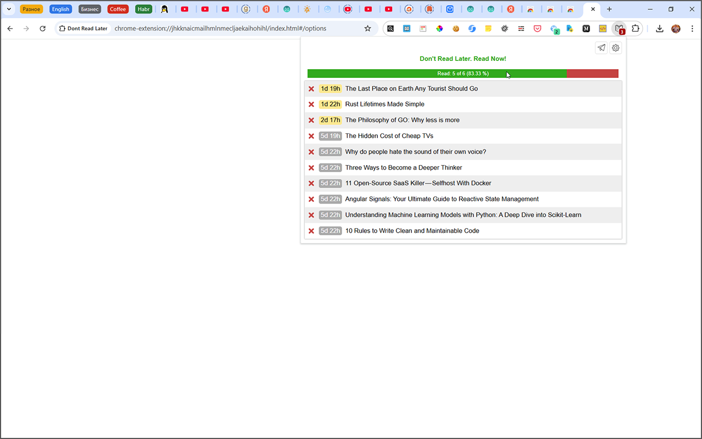

# DontReadLater

**Don't read later, read now! Stop bookmarking and start reading.**

This extension is designed for those who have realized that ever-increasing "Read Later" lists are turning into a useless pile of buried knowledge. This extension is definitely for you if you'd like to transform your digital graveyard into a blooming garden full of growing trees of new knowledge.

The purpose of this extension is to motivate you to read your "Read Later" list regularly, rather than hoard it. Add your links to the list for later reading, as you usually do. The main difference is that every added link has its lifetime (maximum of 7 days). If you don't read it within this time period, the link will be deleted automatically. Don't be afraid of losing your links — if you can't find some free time for reading them within a week, it means that's not important, and anyway, you'd lose them under the pile of new links.

[Frontend README](frontend/README.md)